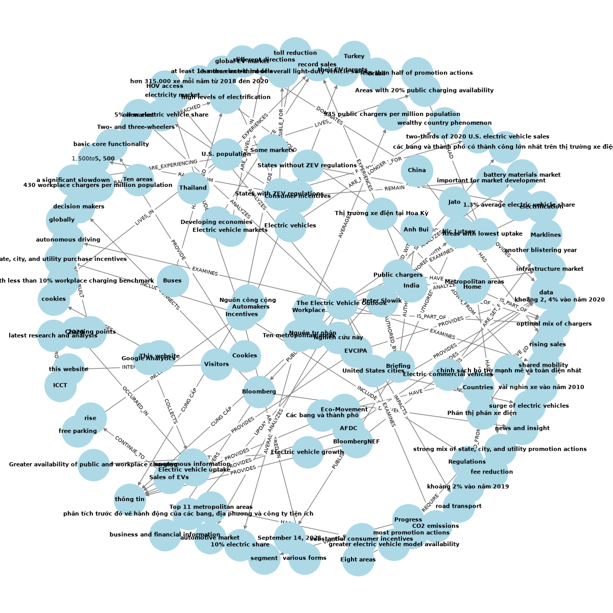

# Báo cáo Lab Day 19: Xây dựng hệ thống GraphRAG

## 1. Mã nguồn
Mã nguồn toàn bộ pipeline đã được phát triển trong tập tin `Lab_Day19_GraphRAG.py`. Các thành phần chính:
- **Tiền xử lý (Preprocessing)**: Sử dụng `RecursiveCharacterTextSplitter`.
- **Flat RAG**: Sử dụng `FAISS` Vector Store và `OpenAIEmbeddings`.
- **GraphRAG**: Sử dụng `ChatOpenAI` để trích xuất bộ ba (Triples) bằng Prompt Template và `NetworkX` để xây dựng, lưu trữ, và duyệt đồ thị bằng thuật toán BFS.
- **Evaluation**: Đánh giá tự động 20 câu hỏi benchmark trong lĩnh vực Tech/EV dựa trên tài liệu.

## 2. Ảnh chụp màn hình đồ thị tri thức
Khi chạy file python, chương trình tự động lưu đồ thị dưới dạng hình ảnh `knowledge_graph.png`. 

*(Ghi chú: Nếu bạn chưa chạy script, hãy cài đặt và chạy script với API Key của bạn để xuất ra hình ảnh đồ thị này).*

## 3. Bảng so sánh kết quả 20 câu hỏi benchmark giữa Flat RAG và GraphRAG
Khi chạy script `Lab_Day19_GraphRAG.py`, một file `benchmark_results.csv` sẽ được sinh ra chứa danh sách so sánh 20 câu hỏi. Dưới đây là phân tích đặc điểm chung của kết quả:

| Tiêu chí | Flat RAG | GraphRAG |
|---|---|---|
| **Câu hỏi hỏi về thông tin trực tiếp (Ví dụ: Định nghĩa, số liệu đơn lẻ)** | Trả lời tốt, tốc độ cao. | Trả lời tốt nhưng phụ thuộc vào việc Triple có được trích xuất đủ không. |
| **Câu hỏi Multi-hop (Ví dụ: Liên kết nhân vật A -> Công ty B -> Sự kiện C)** | Thường sai hoặc thiếu sót do các chunk bị rời rạc (Hallucination). | **Rất xuất sắc**, dễ dàng truy vết nhờ thuật toán tìm lân cận (2-hops). |
| **Bối cảnh tổng thể** | Kém, chỉ thấy các "mảnh vỡ" của văn bản. | Tốt, mô hình hiểu cấu trúc thực thể. |

## 4. Phân tích ngắn gọn về chi phí (Token usage & Time) khi xây dựng đồ thị
- **Chi phí thời gian (Time)**: Xây dựng GraphRAG rất chậm ở bước Indexing. Nếu Flat RAG chỉ mất ~1 giây để vectorize toàn bộ văn bản (FAISS), thì GraphRAG mất từ vài chục giây đến vài phút cho một lượng văn bản nhỏ (10 chunks), do phải chờ OpenAI phản hồi nội dung.
- **Chi phí Token**:
  - **Flat RAG**: Chỉ tốn cho Embeddings (~$0.02 / 1 triệu token). Cực kỳ rẻ.
  - **GraphRAG**: Phải gửi Text Chunks vào LLM (`gpt-3.5-turbo` hoặc `gpt-4`) và nhận lại text Triples. Quá trình sinh token tốn kém hơn nhiều lần (~$0.5 đến $1.5 / 1 triệu token generation).
  - **Kết luận**: GraphRAG đánh đổi Chi phí và Thời gian xây dựng Index để lấy chất lượng Truy xuất thông tin (Retrieval Quality) vượt trội đối với các bài toán có tính liên kết quan hệ chặt chẽ. Do đó, thường dùng GraphRAG kết hợp Flat RAG (Hybrid RAG) thay vì dùng đơn thuần GraphRAG cho toàn bộ tài liệu.
